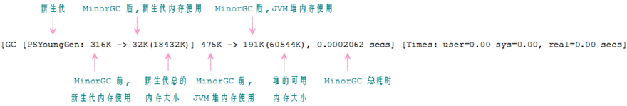
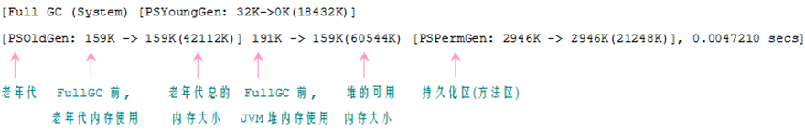

# jvm gc相关资料
1. 垃圾收集器分为,查找->标记->回收->整理,这个整理不是必须的,只有分配内存不够了,才会触发整理碎片,减少小内存碎片,  标记后不会立即清理,标记的规则以前是有个引用计数器,达到0的时候代表没有引用,不过如果发生了环路引用,就会导致一直不会被标记,后面改成了引用可达性, 引用可达分为几种类型,强可达,软可达,弱可达,虚可达,不可达,如果是不可达,就会被标记
2. 一般可分配内存不足了,会触发full gc,全部检查一遍,full gc,执行的过程是最长的,在以前还会造成程序的停顿,所以尽量不要让程序执行full gc
3. System.gc() 主动建议jvm去触发 full gc,不过这个东西尽量别用它,-XX:+ DisableExplicitGC=false 可以禁止调用full gc,防止有人无聊写主动触发gc的代码
4. 通常在需要导出堆转存文件之前 触发一次gc是比较好的
5. jcmd [pid] GC.run  或者 jconsole 上点击gc  触发
6. jstat -gcutil process_id 1000  这里的-gcutil 可以换成其它的, 这句主要是一直打印消耗在GC上的时间
7. Survivor 空间  是为了让刚创建的对象再新生代能存货更长时间,避免直接晋级到老年代,导致老年代经常gc,-XX:InitialSurvivorRatio 控制这个空间的初始大小,也有固定大小的方法
8. 对需要分配大量大型对象的应用，TLAB 空间的调整就变得必不可少（不过，通常情况下，我们更推荐在应用程序中使用小型对象的做法)

## 两种gc类型
1. Full gc,是对整个堆进行整理,不管是,新生代,老年代,永久代(永久代在jdk8被移除了)
2. Mionr gc  新生代GC  ,整个gc是比较频繁,主要是去整理那些临时被创建的对象,像那种多次经历过mionr gc都没有被移除的对象,会被转到老年代里面去

## 不同的垃圾收集器
1. Serial垃圾收集器
    * 配置低的机器使用的,例如32位Windows, XX:+UseSerialGC 可以启动这个收集器
    * 通常仅用于单cpu机器上
    * Serial 收集器最适用于应用程序的内存使用少于 100 MB 的场景
2. Throughput垃圾收集器
    * Throughput 收集器是 Server 级虚拟机（多 CPU 的 Unix 机器以及任何 64 位虚拟机）的默认收集器
    * Jdk7默认收集器,进行垃圾回收的时候会暂停应用线程
    * 多线程的方式进行回收
    * -XX:+UseParallelOldGC,-XX:+UseParallelGC 启用
    * 它能最大化应用程序的总吞吐量，但是有些操作可能遭遇较长的停顿,在cpu差的情况下可以尝试
    * XX:MaxGCPauseMillis 设置gc时能接受的停顿最大时间,注意设置的越小 gc次数越多,虽然每次都比较快,标志的优先级最高：如果设置了这个值，新生代和老年代会随之进行调整
    * -XX:GCTimeRatio 设置线程花多少时间去执行gc,这是个百分比设置,与比如99,百分之1的线程时间花在gc上,百分之99花在应用线程,百分比只是最多花这些时间,而不是一定花这么多时间 
3. CMS收集器
    * 为了消除执行gc的时候造成的应用线程完全停止的问题
    * 多线程的方式回收,mionr gc的时候会暂停应用线程,full gc不会停止应用线程
    * -XX:+UseConcMarkSweepGC 、-XX:+UseParNewGC  启动
    * 比较依赖cpu资源,常用用于  多cpu的情况下
    * CMS 收集器能够在应用线程运行的同时并行地对老年代的垃圾进行收集。如果 CPU 的计算能力足以支撑后台垃圾收集线程的运行，该算法能避免应用程序发生 Full GC
    * 要处理并发gc时失效是比较重要的,主要是新生代晋级到老年代,老年代却存不下了,导致老年代的gc,一方面可以提高堆内存,也可以 CMSInitiatingOccupancyFraction,UseCMSInitiatingOccupancyOnly参数来设置,让它对老年代达到指定存量的时候就开始出发gc
    * Cms默认不会对永久代进行gc -XX:+CMSPermGenSweepingEnabled,-XX:CMSInitiatingPermOccupancyFraction,-XX:+CMSClassUnloadingEnabled开启永久代与老年代一样的gc
4. G1
    * 尽量缩短处理超大堆(大于4g)时产生的停顿,将堆划分为若干个区域
    * Mionr gc依然会暂停应用线程,会将存活下来的对象看情况移动到老年代,不移动到老年代的对象就属于Survivor(幸存者)依然存储在新生代
    * 多线程方式回收,full gc大多数下也是不需要暂停应用线程,由于是将老年代划分为多个区域,通常在回收的时候是将幸存下来的对象都移动到另一个区域,这样的好处是,在进行回收的时候也顺便整理的内存空间,不易产生内存碎片
    * -XX:+UseG1GC 启动
    * G1 收集器也能在应用线程运行的同时并发地对老年代的垃圾进行收集，在某种程度上能够减少发生 Full GC 的风险。G1 的设计理念使得它比 CMS 更不容易遭遇 Full GC
## 收集器的选择
1. 一般情况下,堆空间小于4g,CMS的性能要比G1好,因为CMS的算法比G1简单,适合堆小一点的情况下,因为G1会分割大堆,所以它更适合4G以上的堆内存下选择
2. Throughput 年代比较久,基本上很成熟,G1比较新也许会碰到问题
3. 堆小于100m,选Serial

## jvm调优参数
```
-Xms	初始堆大小。如：-Xms256m
-Xmx	最大堆大小。如：-Xmx512m
-Xmn	新生代大小。通常为 Xmx 的 1/3 或 1/4。新生代 = Eden + 2 个 Survivor 空间。实际可用空间为 = Eden + 1 个 Survivor，即 90%
-Xss	JDK1.5+ 每个线程堆栈大小为 1M，一般来说如果栈不是很深的话， 1M 是绝对够用了的。
-XX:NewRatio	新生代与老年代的比例，如 –XX:NewRatio=2，则新生代占整个堆空间的1/3，老年代占2/3
-XX:NewSize 新生代空间初始大小
-XX:MaxNewSize 新生代空间最大,大小 优先级高于 NewRatio 
-XmnN 同时设置 NewSize,MaxNewSize 值一样
-XX:SurvivorRatio	新生代中 Eden 与 Survivor 的比值。默认值为 8。即 Eden 占新生代空间的 8/10，另外两个 Survivor 各占 1/10
-XX:PermSize	永久代(方法区)的初始大小 jdk1.8中已经不存在了，取而代之的是metaspace元空间，元空间没有大小限制
-XX:MaxPermSize	永久代(方法区)的最大值 jdk1.8中已经不存在了，取而代之的是metaspace元空间，元空间没有大小限制
-XX:+PrintGCDetails	打印 GC 信息
-XX:+PrintGCTimeStamps  GC操作之间的时间
-Xloggc gc日志文件输出,可以通过另外的参数设置GC日志打印的循环,防止GC文件太大了
-XX:+HeapDumpOnOutOfMemoryError	让虚拟机在发生内存溢出时 Dump 出当前的内存堆转储快照，以便分析用
-XX:ParallelGCThreads 垃圾回收处理线程,为了尽可能的利用多cpu,这些线程会创建在不同的cpu上,不要盲目设置太多
-XX:-UseAdaptiveSizePolicy 关闭自适应调整,程序默认会进行自适应调整,对一些内存大小的设置也许在不关闭的情况下,不起作用
-XX:+PrintAdaptiveSizePolicy 查看自适应调整情况

注意：PermSize永久代的概念在jdk1.8中已经不存在了，取而代之的是metaspace元空间，元空间没有大小限制,当认为执行永久代的初始大小以及最大值是jvm会给出如此下提示：
Java HotSpot(TM) 64-Bit Server VM warning: ignoring option PermSize=30m; support was removed in 8.0
Java HotSpot(TM) 64-Bit Server VM warning: ignoring option MaxPermSize=30m; support was removed in 8.0
```
## gc日志分析
1. -XX:+PrintGCDetails=true 开启打印GC日志
2. 可以使用工具 jvisualvm  然后在菜单上选择 tools -> Pulgins  添加Visual GC 有的可能是中文,然后就可以选择监控程序后,多了一栏 Visual GC,用于在线查看gc

### 下面是不使用工具的方式,主要是读离线gc文件
1. minor gc日志解读


2. full gc日志解读


